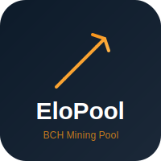

<p align="center">
  
</p>

# EloPool for StartOS

<p align="center">
  
  
  
</p>

**EloPool** is a high-performance Bitcoin Cash mining pool for [StartOS](https://start9.com), built on [ckpool](https://github.com/skaisser/ckpool). It provides **dual-mode** operation — pool mining and solo mining — with a built-in web dashboard.

## Features

- **Pool Mining** (port 3333) — Shared block rewards among all miners
- **Solo Mining** (port 4567) — Winner takes the entire block reward
- **Web Dashboard** (port 80) — Real-time hashrate, workers, blocks found
- **Stratum Protocol** — Compatible with all ASIC miners (Antminer, Whatsminer, Bitaxe, etc.)
- **Auto-configured** — Automatically connects to your Bitcoin Cash Node (BCHN or Knuth)
- **Multi-architecture** — Runs on x86_64 and aarch64

## Architecture

```
┌─────────────────────────────────────────────────────┐
│                   EloPool Package                    │
│                                                      │
│  ┌──────────────┐  ┌──────────────┐  ┌────────────┐ │
│  │  Pool ckpool │  │  Solo ckpool │  │  Web UI    │ │
│  │  :3333       │  │  :4567       │  │  :80       │ │
│  │  (shared)    │  │  (solo)      │  │  (nginx)   │ │
│  └──────┬───────┘  └──────┬───────┘  └─────┬──────┘ │
│         │                 │                │         │
│         └────────┬────────┘                │         │
│                  │                         │         │
│         ┌───────▼────────┐     ┌──────────▼───────┐ │
│         │  /data volume  │     │  stats-api.sh    │ │
│         │  (ckpool runs) │◄────│  (logs → JSON)   │ │
│         └───────┬────────┘     └──────────────────┘ │
│                 │                                    │
└─────────────────┼────────────────────────────────────┘
                  │ RPC (8332)
         ┌────────▼────────┐
         │  Bitcoin Cash   │
         │  Node (BCHN     │
         │  or Knuth)      │
         └─────────────────┘
```

## Dependencies

| Package | Required | Notes |
|---------|----------|-------|
| **Bitcoin Cash Node** | Yes | BCHN, BCHD or Knuth. Must be fully synced with txindex enabled. |

## Quick Start

1. **Install Bitcoin Cash Node** on your StartOS server and wait for full sync
2. **Install EloPool** from the marketplace
3. **Configure** — Set your BCH payout address via Actions → Configure
4. **Point your miners** at:
   - Pool mode: `stratum+tcp://<your-server>:3333`
   - Solo mode: `stratum+tcp://<your-server>:4567`
5. **Monitor** via the Web Dashboard

### Miner Configuration

| Setting | Value |
|---------|-------|
| **URL** | `stratum+tcp://<host>:3333` (pool) or `:4567` (solo) |
| **Username** | Your BCH address |
| **Password** | Anything (or `d=DIFFICULTY` for custom difficulty) |

### Tor / Onion Mining (optional)

Every stratum binding can be exposed over **Tor** so remote miners connect over the Tor network without touching your LAN.

1. Open StartOS → **EloPool** → **Interfaces**.
2. For `Pool Mining`, `Solo Mining`, or `Web Dashboard`: tap **Add**, choose **Tor**.
3. StartOS generates a `.onion` address automatically. Point your Tor-aware miner at:
   ```
   stratum+tcp://<xxxx>.onion:3333   # pool
   stratum+tcp://<xxxx>.onion:4567   # solo
   ```
4. Re-run `setup-vm-forwarding.sh` — it will auto-detect the enabled `.onion` URLs and print/save them alongside your LAN URLs.

The onion keys survive StartOS reboots and are preserved by the standard StartOS backup system.

### Dashboard Metrics — What the Numbers Mean

- **Accepted** — accepted shares, as reported by ckpool's `accepted` JSON field. This is the standard ckpool/asicseer-pool metric: a difficulty-weighted sum, not a raw submit count. Displayed with SI suffix (e.g. `176.00 M`). Higher is better.
- **Rejected** — rejected shares (`rejected` field): stale, invalid, or below assigned difficulty. Should stay near zero.
- **Best Share** — highest individual share difficulty ever accepted for this worker. When this approaches the network difficulty (~355 EH at current BCH diff) a block is about to be found.
- **Found Blocks** (main card) — counted by listing files in `/data/pool/log/pool/blocks/`. ckpool/asicseer-pool writes exactly one file per solved block, so this is a true integer count, not derived from share work.

## Running StartOS in a Virtual Machine

If you run StartOS inside a **libvirt/KVM virtual machine** (e.g. via `virt-manager`), miners on your local network cannot reach the VM directly because libvirt uses a NAT bridge (`virbr0`). You need to forward the mining ports from your host machine to the VM.

This works with **any connection type** — wired (Ethernet), wireless (WiFi), or both simultaneously.

### One-Command Setup (Linux)

Download and run the setup script:

```bash
curl -fsSL https://raw.githubusercontent.com/BitcoinCash1/bch-elopool-startos/master/scripts/setup-vm-forwarding.sh -o setup-vm-forwarding.sh
chmod +x setup-vm-forwarding.sh
sudo ./setup-vm-forwarding.sh
```

That's it. The script will:

1. Auto-detect your StartOS VM and its IP address
2. Pin the VM's IP so it doesn't change on reboot (static DHCP lease)
3. Install a [libvirt qemu hook](https://wiki.libvirt.org/Networking.html#forwarding-incoming-connections) that automatically forwards ports whenever the VM starts
4. Detect **all** your physical network interfaces (wired + wireless) and forward on each
5. Print the exact stratum URLs to use for your miners
6. Best-effort: detect any `.onion` addresses you have enabled for the pool and print those too (see [Tor / Onion Mining](#tor--onion-mining-optional))

The rules **persist across host reboots automatically** — the hook is invoked by libvirt every time the VM starts, so there is no cron job or systemd unit to maintain.

```
$ sudo ./setup-vm-forwarding.sh
[OK] Found VM: Start9OS
[OK] VM IP: 192.168.122.129
[OK]   eno1 (192.168.0.55)          ← wired
[OK]   wlp4s0 (192.168.0.156)      ← wireless
[OK] Hook installed at /etc/libvirt/hooks/qemu
[OK] Forwarding rules active

  Miner configuration — use ANY of these addresses:

    via eno1 (192.168.0.55):
      EloPool:        stratum+tcp://192.168.0.55:3333
      EloPool Solo:   stratum+tcp://192.168.0.55:4567

    via wlp4s0 (192.168.0.156):
      EloPool:        stratum+tcp://192.168.0.156:3333
      EloPool Solo:   stratum+tcp://192.168.0.156:4567
```

### Management Commands

```bash
# Check current status
sudo ./setup-vm-forwarding.sh --status

# Completely remove (restores system to default)
sudo ./setup-vm-forwarding.sh --remove

# Specify VM name manually (if auto-detect fails)
sudo ./setup-vm-forwarding.sh "My StartOS VM"
```

### How It Works

The script installs `/etc/libvirt/hooks/qemu` — the [official libvirt hook mechanism](https://wiki.libvirt.org/Networking.html#forwarding-incoming-connections). When the VM starts, the hook adds `iptables` DNAT rules that forward incoming connections on ports 3333, 4567, and 80 from every physical network interface to the VM. When the VM stops, the rules are automatically removed.

```
┌─────────────┐     ┌──────────────────┐     ┌──────────────────┐
│   Miner     │────▶│  Host Machine    │────▶│  StartOS VM      │
│ 192.168.0.x │     │  eno1/wlp4s0     │     │  192.168.122.x   │
│             │     │  (iptables DNAT) │     │  (virbr0 NAT)    │
└─────────────┘     └──────────────────┘     └──────────────────┘
  stratum+tcp://       port forwarding          ckpool listening
  192.168.0.55:3333    3333 → VM:3333           on :3333
```

No bridges, no NetworkManager changes, no DNS changes. Just iptables rules managed by the official libvirt hook system.

### One-Command Setup (Windows)

Supports **VirtualBox** and **Hyper-V**. Open PowerShell **as Administrator** and run:

```powershell
Invoke-WebRequest -Uri "https://raw.githubusercontent.com/BitcoinCash1/bch-elopool-startos/master/scripts/setup-vm-forwarding.ps1" -OutFile setup-vm-forwarding.ps1
.\setup-vm-forwarding.ps1
```

The script will auto-detect your VM and hypervisor, set up port forwarding, save a `Miner-Connection-Info.txt` to your Desktop, and open a copyable popup with your stratum URLs.

```powershell
# Management
.\setup-vm-forwarding.ps1 -Status       # show current state
.\setup-vm-forwarding.ps1 -Remove       # uninstall everything
.\setup-vm-forwarding.ps1 -VMName "My VM"  # specify VM name
```

### One-Command Setup (macOS)

Supports **VirtualBox** and **UTM**. Open Terminal and run:

```bash
curl -fsSL https://raw.githubusercontent.com/BitcoinCash1/bch-elopool-startos/master/scripts/setup-vm-forwarding-mac.sh -o setup-vm-forwarding-mac.sh
chmod +x setup-vm-forwarding-mac.sh
sudo ./setup-vm-forwarding-mac.sh
```

Same features: auto-detect, Desktop txt file, popup with Copy to Clipboard button.

```bash
sudo ./setup-vm-forwarding-mac.sh --status    # show current state
sudo ./setup-vm-forwarding-mac.sh --remove    # uninstall everything
```

> **Tip (all platforms):** If you use **Bridged Networking** instead of NAT, the VM gets its own LAN IP and miners can connect directly — no port forwarding script needed.

### Troubleshooting

| Problem | Solution |
|---------|----------|
| Script says "VM not found" | Run `virsh list --all` to see VM names, then pass it: `sudo ./setup-vm-forwarding.sh "exact name"` |
| Script says "Cannot determine VM IP" | Start the VM first, wait 30 seconds for it to get an IP, then run again |
| Miner connects but pool shows no hashrate | Check that the pool service is running on StartOS (Actions → Start) |
| Port forwarding stops after reboot | The hook should auto-apply when the VM starts. Run `sudo ./setup-vm-forwarding.sh --status` to verify the hook file exists |
| Want to undo everything | `sudo ./setup-vm-forwarding.sh --remove` restores your system completely |
| Windows: "execution policy" error | Run `Set-ExecutionPolicy -Scope Process -ExecutionPolicy Bypass` first |
| macOS: VBox rules need VM stopped | Shut down the VM, run the script, then start the VM |
| macOS UTM: need guest IP | Find it inside StartOS (System → Network) and enter when prompted |

## Building from Source

```bash
# Prerequisites: StartOS SDK, Docker, Node.js 20+
git clone https://github.com/BitcoinCash1/bch-elopool-startos.git
cd bch-elopool-startos
npm install
make
```

## Port Allocation

| Port | Protocol | Purpose |
|------|----------|---------|
| 3333 | Stratum (TCP) | Pool mining |
| 4567 | Stratum (TCP) | Solo mining |
| 80 | HTTP | Web dashboard |

## Configuration Options

| Option | Default | Description |
|--------|---------|-------------|
| Payout Address | *(required)* | BCH address for coinbase rewards |
| Pool Fee | 1% | Fee percentage for pool mode (solo is always 0%) |
| Pool Identifier | `EloPool` | Coinbase signature visible on block explorers |
| Starting Difficulty | 64 | Initial share difficulty for new workers |

## How It Works

EloPool runs two independent ckpool instances from the same Docker image:
- **Pool instance** shares rewards proportionally based on submitted shares
- **Solo instance** directs the entire block reward to whichever miner finds it

Both instances connect to your Bitcoin Cash Node via RPC. The web dashboard reads ckpool's log files directly and serves stats as static JSON via nginx.

You can point different miners to different modes simultaneously — no reconfiguration needed.

## Upstream

- [skaisser/ckpool](https://github.com/skaisser/ckpool) — EloPool fork of ckpool
- [bitcoin-cash-node](https://github.com/bitcoin-cash-node/bitcoin-cash-node) — Bitcoin Cash full node

## License

GPL-3.0 — matches upstream ckpool license.

---

<details>
<summary><strong>AI Reference Prompt</strong></summary>

```yaml
package: bch-elopool
type: startos-service
sdk: "@start9labs/start-sdk@1.0.0"
upstream: skaisser/ckpool
depends_on: bitcoincashd (BCHN or Knuth flavor)
ports:
  pool: 3333 (stratum)
  solo: 4567 (stratum)
  ui: 80 (http)
daemons: 3 (pool-ckpool, solo-ckpool, ui-nginx)
volumes: main (/data)
dependency_mount: /mnt/bitcoincashd (reads store.json for RPC creds)
critical_tasks: txindex=true, prune=null, zmqEnabled=true
config_fields: payoutAddress, poolFee, poolIdentifier, poolDifficulty
webui: nginx serving static HTML + stats-api.sh background (logs → JSON)
build: multi-stage Docker (ubuntu build-ckpool → node:20-bookworm-slim runtime)
```

</details>
