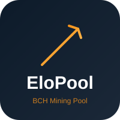

<div align="center">
  
  <h1>EloPool</h1>
</div>

> **Upstream docs:** [github.com/skaisser/ckpool](https://github.com/skaisser/ckpool)
>
> EloPool is a high-performance Bitcoin Cash mining pool built on ckpool. It supports dual-mode operation — pool mining with shared rewards and solo mining with winner-takes-all — and includes a built-in web dashboard for real-time monitoring.

---

## Table of Contents

1. [Image and Container Runtime](#1-image-and-container-runtime)
2. [Volume and Data Layout](#2-volume-and-data-layout)
3. [Installation and First-Run Flow](#3-installation-and-first-run-flow)
4. [Default Networking](#4-default-networking)
5. [Configuration Management](#5-configuration-management)
6. [Network Access and Interfaces](#6-network-access-and-interfaces)
7. [Actions (StartOS UI)](#7-actions-startos-ui)
8. [Backups and Restore](#8-backups-and-restore)
9. [Health Checks](#9-health-checks)
10. [Dependencies](#10-dependencies)
11. [Default Overrides](#11-default-overrides)
12. [Limitations and Differences](#12-limitations-and-differences)
13. [What Is Unchanged from Upstream](#13-what-is-unchanged-from-upstream)
14. [Contributing](#14-contributing)
15. [Quick Reference for AI Consumers](#15-quick-reference-for-ai-consumers)

---

## 1. Image and Container Runtime

| Field | Value |
|---|---|
| **Image ID** | `elopool` |
| **Build** | Docker build from `Dockerfile.binary` (pulls pre-built binary from GHCR: `ghcr.io/bitcoincash1/elopool-bch`) |
| **Architectures** | `x86_64`, `aarch64` (aarch64 emulates as x86_64 if not natively available) |
| **Pool daemon command** | `pool-entrypoint.sh pool /data/pool/elopool.conf` |
| **Solo daemon command** | `pool-entrypoint.sh solo /data/solo/elopool.conf` |
| **UI daemon command** | `ui-entrypoint.sh` |
| **SubContainers** | Three separate SubContainers: `pool-sub`, `solo-sub`, `ui-sub` |

---

## 2. Volume and Data Layout

| Volume Name | Mount Point | Purpose |
|---|---|---|
| `main` | `/data` | Pool configuration, share logs, statistics |

**StartOS-managed files inside `/data`:**

| File / Directory | Managed By | Purpose |
|---|---|---|
| `store.json` | StartOS SDK file model | Package state: payout address, pool fee, difficulty, node selection, RPC credentials |
| `pool/elopool.conf` | Written at runtime from `store.json` | ckpool-format JSON config for pool mode daemon |
| `solo/elopool.conf` | Written at runtime from `store.json` | ckpool-format JSON config for solo mode daemon |
| `pool/log/` | EloPool | Pool mode share logs and statistics |
| `solo/log/` | EloPool | Solo mode share logs and statistics |

**Dependency volume mounted at runtime (read-only):**

| Mount Point | Source | Purpose |
|---|---|---|
| `/mnt/node` | Selected node package `main` volume | Read `store.json` for node RPC credentials |

---

## 3. Installation and First-Run Flow

1. StartOS builds or pulls the `elopool` container image.
2. Seed files are written: `store.json` with defaults (payout address empty, pool fee 1%, identifier `EloPool`, starting difficulty 42, node: BCHN).
3. On start, the Node Backend selection is confirmed (a task prompts the user if not yet set).
4. EloPool reads node RPC credentials from `/mnt/node/store.json` inside the pool SubContainer (up to 15 retry attempts with 2-second delays).
5. A JSON-RPC probe (`getblockchaininfo` + `getblocktemplate`) is sent to the node to verify it is synced and ready for mining (up to 30 attempts).
6. Pool and solo config files (`elopool.conf`) are written to `/data/pool/` and `/data/solo/` with the live RPC credentials and configured parameters.
7. Three daemons start: pool mode stratum (port 3333), solo mode stratum (port 4567), and web UI (port 80).
8. Miners point their ASIC hardware to the stratum URLs shown in Connection Info.

---

## 4. Default Networking

| Transport | Default | Inbound | How to Change |
|---|---|---|---|
| **Clearnet (IPv4/IPv6)** | Enabled — all three ports exposed by StartOS | Enabled for miners and dashboard browsers | Managed by StartOS |
| **Tor (node RPC)** | Off | Not applicable — for outbound RPC to the node only | Set RPC Network Mode to "Prefer Tor" or "Tor Only" in Configure action |

---

## 5. Configuration Management

| Group | Settings Covered |
|---|---|
| **Select Node Backend** | Choose which BCH full node provides mining RPC: BCHN, BCHD, Flowee |
| **Configure** | Payout address, pool fee (%), pool identifier (coinbase tag), starting difficulty, node address mode (auto/custom), custom node host/port, Tor RPC mode, Tor proxy host/port, RPC credentials source (auto/manual), manual RPC username/password |

---

## 6. Network Access and Interfaces

| Interface | Port | Protocol | Purpose | Condition |
|---|---|---|---|---|
| Pool Mining | 3333 | TCP (Stratum v1) | Shared reward pool mining — connect ASIC hardware here | Always |
| Solo Mining | 4567 | TCP (Stratum v1) | Winner-takes-all solo mining | Always |
| Web Dashboard | 80 | HTTP | Real-time pool and solo mining statistics | Always |

---

## 7. Actions (StartOS UI)

### Info

| Action ID | Name | Description |
|---|---|---|
| `connection-info` | Connection Info | Displays stratum URLs for pool and solo mining, username format, and password convention |

### Configuration

| Action ID | Name | Description |
|---|---|---|
| `select-node` | Select Node Backend | Choose which installed BCH node package provides mining RPC |
| `configure` | Configure | Set payout address, pool fee, pool identifier, starting difficulty, node endpoint, Tor RPC mode, and credential source |

### Maintenance

| Action ID | Name | Description |
|---|---|---|
| `reset-mining-state` | Wipe Mining State | Clear all share logs and restart the pool; miners reconnect at configured starting difficulty |

---

## 8. Backups and Restore

**What IS backed up:**
- `store.json` — all pool configuration, selected node, payout address, fee settings
- `pool/elopool.conf` and `solo/elopool.conf` — generated config files
- `pool/log/` and `solo/log/` — share logs and statistics

**What is NOT backed up:**
- Nothing is explicitly excluded — the entire `main` volume is backed up.

Restoring will overwrite current pool configuration. Share statistics are included in the backup.

---

## 9. Health Checks

| Check | Method | Key Messages |
|---|---|---|
| **Pool Mining** (daemon ready) | `sdk.healthCheck.checkPortListening` on port 3333 | `Pool mining stratum ready on port 3333` / `Pool mining stratum starting...` |
| **Solo Mining** (daemon ready) | `sdk.healthCheck.checkPortListening` on port 4567 | `Solo mining stratum ready on port 4567` / `Solo mining stratum starting...` |
| **Web UI** (daemon ready) | `sdk.healthCheck.checkPortListening` on port 80 | `Web dashboard is ready` / `Web dashboard starting...` |

---

## 10. Dependencies

### Bitcoin Cash Node — BCHN (optional)

| Field | Value |
|---|---|
| **Package ID** | `bitcoincashd` |
| **Version constraint** | Any |
| **Required state** | Running and fully synced; `getblocktemplate` must succeed |
| **Mounted volumes** | `main` volume mounted read-only at `/mnt/node` for credential discovery |
| **Purpose** | Provides JSON-RPC for block template generation and submission |

### Bitcoin Cash Daemon — BCHD (optional)

| Field | Value |
|---|---|
| **Package ID** | `bchd` |
| **Version constraint** | Any |
| **Required state** | Running and fully synced |
| **Mounted volumes** | `main` volume mounted read-only at `/mnt/node` for credential discovery |
| **Purpose** | Go BCH full node alternative; EloPool automatically uses BCHD's plaintext proxy port 8334 instead of 8332 (BCHD RPC requires TLS; ckpool-lineage has no TLS library) |

### Flowee the Hub (optional)

| Field | Value |
|---|---|
| **Package ID** | `flowee` |
| **Version constraint** | Any |
| **Required state** | Running and fully synced |
| **Mounted volumes** | `main` volume mounted read-only at `/mnt/node` for credential discovery |
| **Purpose** | Fast BCH validator alternative; uses SPV-level validation — not recommended as sole mining node for production block creation |

### Tor (optional)

| Field | Value |
|---|---|
| **Package ID** | `tor` |
| **Version constraint** | Any |
| **Required state** | Running (only needed when RPC Network Mode is set to Tor) |
| **Mounted volumes** | None |
| **Purpose** | SOCKS5 proxy for routing node RPC calls over Tor (onion-routed node endpoint support) |

**At least one of BCHN, BCHD, or Flowee must be installed and selected.**

---

## 11. Default Overrides

| Setting | Upstream Default | StartOS Value | Reason |
|---|---|---|---|
| Node RPC port for BCHD | 8332 (standard) | 8334 (stunnel plaintext proxy) | ckpool-lineage has no TLS library; BCHD exposes a plaintext proxy on 8334 as a StartOS sidecar |
| `pool_fee` JSON format | Integer OK | Forced to float (e.g., `1.0` not `1`) | ckpool requires `pool_fee` to be a JSON float value |
| Starting difficulty | 42 | 42 (configurable) | Upstream default; exposed for adjustment to match hardware hash rate |

---

## 12. Limitations and Differences

1. EloPool requires a BCH full node with a **working `getblocktemplate` RPC**. If the selected node is not fully synced or `getblocktemplate` fails, EloPool will not start (up to 30 probe attempts, 2 seconds apart).
2. **Solo mode has 0% pool fee** by design. All reward goes to the configured payout address when a block is found.
3. There is **no per-miner authentication**. Miners use their BCH payout address as the Stratum username. The pool pays directly to whatever address the miner configures.
4. **Flowee is not recommended as the sole mining node** for production block creation. Flowee uses SPV-level validation and could theoretically accept an invalid chain tip. Use BCHN or BCHD for production mining.
5. The web dashboard (port 80) provides real-time stats but no configuration interface. All configuration is via the StartOS Actions.
6. EloPool does **not** include the developer donation toggle that ASICSeer has. EloPool is a different upstream fork (skaisser/ckpool vs cculianu/asicseer-pool).
7. Share statistics are **reset to zero** when the Wipe Mining State action is used.

---

## 13. What Is Unchanged from Upstream

- All upstream ckpool / skaisser Stratum v1 protocol behavior
- Vardiff (variable difficulty) adjustment algorithm
- Share accounting and block submission logic
- Web UI dashboard format and metrics
- Coinbase transaction construction

---

## 14. Contributing

See [CONTRIBUTING.md](CONTRIBUTING.md)

---

## 15. Quick Reference for AI Consumers

```yaml
package_id: bch-elopool
title: EloPool
license: GPL-3.0
upstream_repo: https://github.com/skaisser/ckpool
package_repo: https://github.com/BitcoinCash1/bch-elopool-startos
image:
  id: elopool
  build: dockerfile
  source: Dockerfile.binary (pre-built GHCR binary ghcr.io/bitcoincash1/elopool-bch)
architectures:
  - x86_64
  - aarch64
volumes:
  - name: main
    mountpoint: /data
    purpose: pool config, share logs, statistics
ports:
  - interface: pool-mining
    port: 3333
    protocol: tcp
    purpose: Stratum v1 pool mining (shared rewards)
    condition: always
  - interface: solo-mining
    port: 4567
    protocol: tcp
    purpose: Stratum v1 solo mining (winner-takes-all)
    condition: always
  - interface: web-ui
    port: 80
    protocol: http
    purpose: Web dashboard for real-time pool statistics
    condition: always
dependencies:
  bitcoincashd:
    optional: true
    purpose: BCHN full node — JSON-RPC for block template and submission
  bchd:
    optional: true
    purpose: BCHD full node — uses plaintext proxy port 8334 (ckpool has no TLS)
  flowee:
    optional: true
    purpose: Flowee the Hub — fast BCH validator (not recommended sole mining node)
  tor:
    optional: true
    purpose: SOCKS5 proxy for Tor-routed node RPC
startos_managed_files:
  - /data/store.json
  - /data/pool/elopool.conf
  - /data/solo/elopool.conf
actions:
  - { id: connection-info, name: "Connection Info", group: Info }
  - { id: select-node, name: "Select Node Backend", group: Configuration }
  - { id: configure, name: "Configure", group: Configuration }
  - { id: reset-mining-state, name: "Wipe Mining State", group: Maintenance }
health_checks:
  - { id: pool, display: "Pool Mining", method: "port 3333 listen check" }
  - { id: solo, display: "Solo Mining", method: "port 4567 listen check" }
  - { id: ui, display: "Web UI", method: "port 80 listen check" }
backup_volumes:
  - main
backup_excludes: []
```
